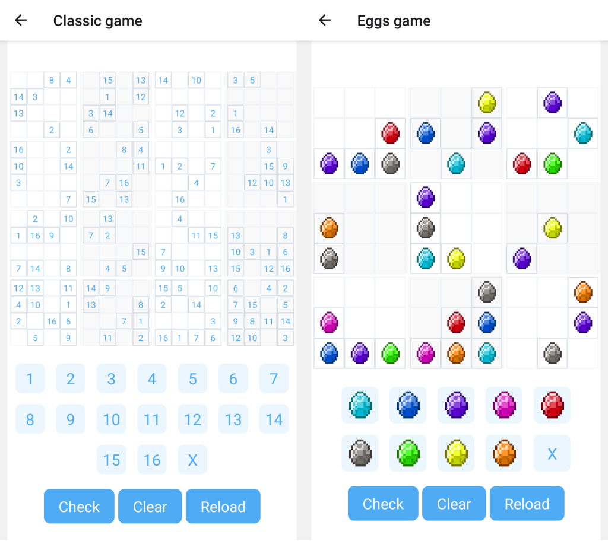

# Sudoku Native Mobile App



**Sudoku Native Mobile App** is a cutting-edge mobile application built with [**React Native**](https://reactnative.dev). It offers an immersive Sudoku experience, blending traditional puzzle-solving with modern mobile functionalities. Whether you're a Sudoku enthusiast or new to the game, this app provides an engaging and seamless experience across both Android and iOS platforms.

## 📱 Download

- **[Google Play Store](https://play.google.com/store/apps/details?id=com.twoj.sudoku)**
- **[Apple App Store](https://apps.apple.com/pl/app/sudoku-mix-quadoku/id6474512012)**
- **[Official Website](https://twoj.io/)**

## 🚀 Getting Started

Follow these steps to set up and run the Sudoku Native Mobile App project on your local machine for development and testing purposes.

### 🔧 Prerequisites

Before you begin, ensure you have met the following requirements:

- **Operating System:** Windows, macOS, or Linux
- **Development Tools:** [Node.js](https://nodejs.org/) (version X.X or higher)
- **Package Manager:** [npm](https://www.npmjs.com/) or [Yarn](https://yarnpkg.com/)
- **React Native CLI:** Install globally using `npm install -g react-native-cli`
- **SDKs:** Android SDK and/or Xcode for iOS development
- **Other Dependencies:** Ensure you have [Watchman](https://facebook.github.io/watchman/) installed (for macOS users)

### 📦 Installation

1. **Clone the Repository**

   Open your terminal or command prompt and run:

   ```bash
   git clone https://github.com/yourusername/sudoku-native-mobile-app.git
   ```

2. **Navigate to the Project Directory**

   ```bash
   cd sudoku-native-mobile-app
   ```

3. **Install Dependencies**

   Using npm:

   ```bash
   npm install
   ```

   Or using Yarn:

   ```bash
   yarn install
   ```

4. **Install Pods (iOS Only)**

   If you're setting up for iOS, navigate to the `ios` directory and install pods:

   ```bash
   cd ios
   pod install
   cd ..
   ```

### 🏃 Running the Project

1. **Start the Metro Server**

   First, you need to start **Metro**, the JavaScript bundler that comes with React Native.

   From the root of your React Native project, run:

   ```bash
   # Using npm
   npm start

   # OR using Yarn
   yarn start
   ```

2. **Start Your Application**

   With Metro Bundler running in its own terminal, open a new terminal window and navigate to the root of your React Native project. Then, run the following commands to start your **Android** or **iOS** app:

   - **For Android**

     ```bash
     # Using npm
     npm run android

     # OR using Yarn
     yarn android
     ```

   - **For iOS**

     ```bash
     # Using npm
     npm run ios

     # OR using Yarn
     yarn ios
     yarn ios --udid "8C034B93-DB54-4C31-A171-7F0FA9FC438E"
     ```

   If everything is set up correctly, your new app should launch in your **Android Emulator** or **iOS Simulator** shortly. Ensure your emulator/simulator is properly configured.

   *Alternatively*, you can run the app directly from **Android Studio** or **Xcode** respectively.

3. **Testing**

   - Verify that the game runs smoothly on your device.
   - Test all features to ensure they function as expected.


---

## 🎨 Modifying Your App

Now that you've successfully run the app, let's make some modifications:

1. **Edit `App.tsx`**

   Open `App.tsx` in your preferred text editor and make your desired changes.

2. **Reload the App to See Changes**

   - **For Android:**
     - Press the <kbd>R</kbd> key twice in the terminal.
     - OR select **"Reload"** from the **Developer Menu** by pressing <kbd>Ctrl</kbd> + <kbd>M</kbd> (Windows/Linux) or <kbd>Cmd</kbd> + <kbd>M</kbd> (macOS).

   - **For iOS:**
     - Press <kbd>Cmd</kbd> + <kbd>R</kbd> in the iOS Simulator.

   Your changes should now be visible in the running app!

## 🎉 Congratulations! :tada:

You've successfully run and modified your React Native App. :partying_face:

### What's Next?

- **Integrate with Existing Apps:** If you want to add this new React Native code to an existing application, check out the [Integration Guide](https://reactnative.dev/docs/integration-with-existing-apps).
- **Learn More About React Native:** Dive deeper with the [Introduction to React Native](https://reactnative.dev/docs/getting-started).

## 🛠️ Troubleshooting

If you encounter issues, refer to the [Troubleshooting](https://reactnative.dev/docs/troubleshooting) page for solutions.

## 📚 Learn More

Enhance your knowledge of React Native with these resources:

- **[React Native Website](https://reactnative.dev):** Discover more about React Native.
- **[Getting Started](https://reactnative.dev/docs/environment-setup):** Overview of React Native and environment setup.
- **[Learn the Basics](https://reactnative.dev/docs/getting-started):** Guided tour of React Native basics.
- **[Blog](https://reactnative.dev/blog):** Read the latest official React Native blog posts.
- **[`@facebook/react-native`](https://github.com/facebook/react-native):** The open-source GitHub repository for React Native.

---

## 📝 License

This project is licensed under the [MIT License](LICENSE).

## 📬 Contact

- **Website:** [https://twoj.io/](https://twoj.io/)
- **Email:** [your-email@example.com](mailto:your-email@example.com)

---

*Happy Coding! 🚀*
